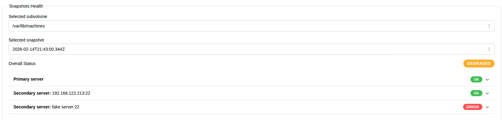
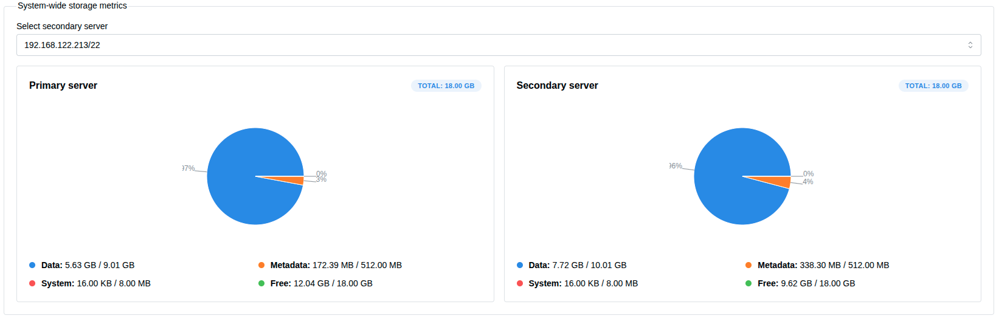
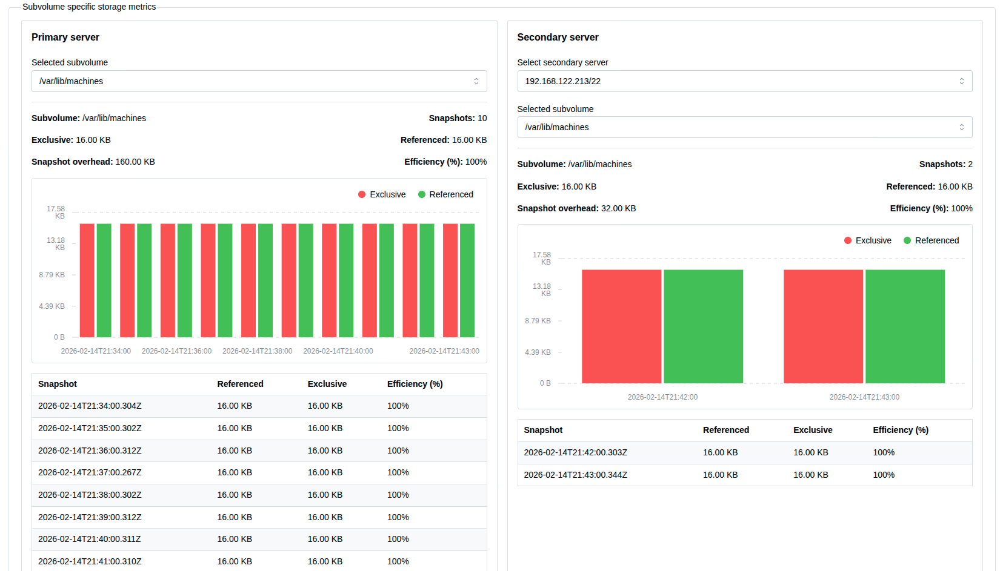

Monitoring & reporting page
==============================

The monitoring & reporting page provides a lot of useful information to system administrators and users of dist-btrfs regarding the health of snapshots, system-wide storage metric and subvolume specific storage metrics.

Sections
----------------------------------------------------------------

* **Snapshots health** - provides information about the health of snapshots on the secondary servers, should be utilized to see which servers do not have this snapshot replicated.
* **System wide storage metrics** - shows the system-wide storage metrics on the primary server and one of the secondary servers and visualizes it with a pie chart.
* **Subvolume specific storage metrics** - shows subvolume specific storage metrics for the primary server and one of the secondary servers, also visualizes the data shown with a bar chart.

Important metrics
----------------------------------------------------------------

Metrics regarding system-wide storage metrics

* **Data** - actual user data stored on disk (files, backups, databases, etc.)
* **Metadata** - filesystem data such as inodes, directories, internal btrfs structures
* **System** - low level filesystem structures required for btrfs to operate
* **Free** - currently unused disk space available for new Data

Subvolume specific storage metrics

* **Exclusive** - actual disk space used only by this subvolume (not shared with snapshots)
* **Referenced** - logical size of all data visible inside the subvolume
* **Snapshots overhead** - total additional disk space consumed by all snapshots of this subvolume
* **Efficiency** - how efficiently Copy-on-Write saves space, higher percentage means better efficiency

Snapshots health
----------------------------------------------------------------

Allows us to select a subvolume from the subvolume selector and one of its snapshots. 

In case snapshot does not exist we get greeted by this screen:

.. image:: ./images/pic41.png

If we select a subvolume with snapshots, and one of the snapshots, we can see the overall status and the status of the snapshot on each server.

The overall status displays as OK only when the snapshot exists on each added remote server.

If we click on one of the accordions, we can see some data:

.. image:: ./images/pic43.png

System-wide storage metrics
----------------------------------------------------------------

On the system wide storage metrics, we see the metrics represented in a pie-chart and a legend explaining them.

We can also optionally select one secondary server and see the metrics for that secondary server as well.

Subvolume specific storage metrics
----------------------------------------------------------------

On the subvolume specific storage metrics, we can see the metrics represented in a bar-chart and in tabular view.

We can also optionally select one of the secondary servers and see the metrics for one of its subvolumes as well.

Overview
----------------------------------------------------------------

You can see some useful information on this page, and its usage is pretty self explanatory.