Remote replication page
==============================

The remote replication page is the page where you can send snapshots from your primary server to your secondary servers.

With this page you can replicate your snapshots, and easily create backups on remote servers.

btrfs itself allows for two types of remote replications:

* **Full replication** - the entire snapshot is sent to the remote servers
* **Incremental replication** - this allows us to only send the diff between two snapshots to the remote server, saving up on bandwidth and speed.

Because of this, the page itself is split into two tabs, similar to the automation page:

* **Full replication tab** - handles the logic behind full replication
* **Incremental replication tab** - handles the logic behind incremental replication

The look of the full replication tab
----------------------------------------------------------------

This is how the full replication tab would look like when it is empty.

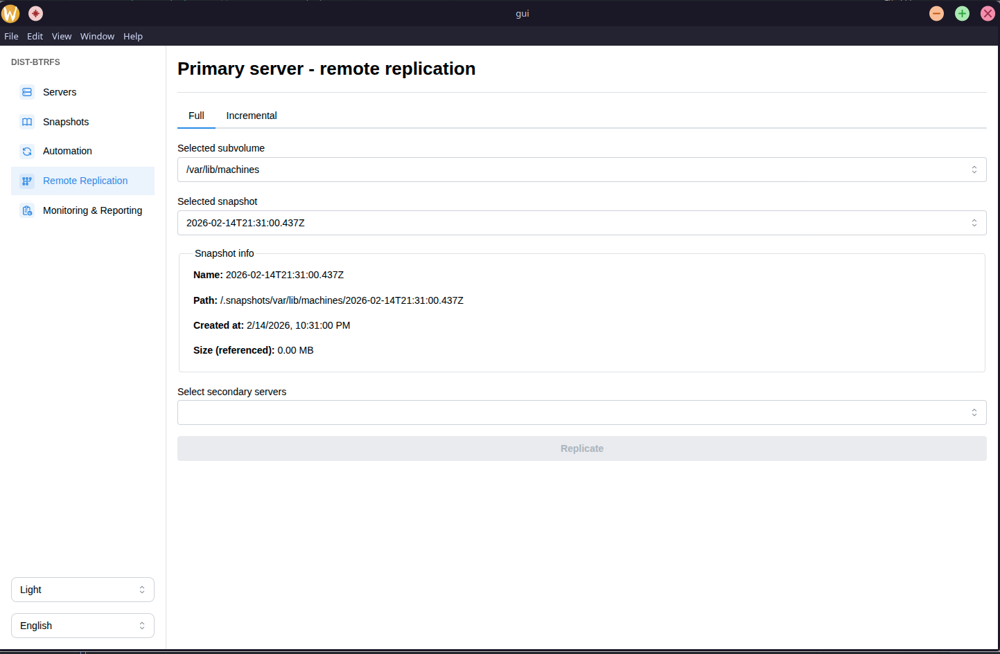

As you can see, we are presented with a large but at the same time really simple form that we need to fill out in order to send one of our snapshots from one of our subvolumes to one or many remote servers.

It consists of a subvolume selector, snapshot selector and the section that displays information about the selected snapshot, and the selector of remote servers where we wish to apply the full replication.

The replicate button only gets enabled after all data gets filled.

Doing your first full replication
----------------------------------------------------------------

First we need to select the subvolume via the subvolume selector.

In case the subvolume has no snapshots, we will not be allowed to proceed and we would be greeted with this screen.

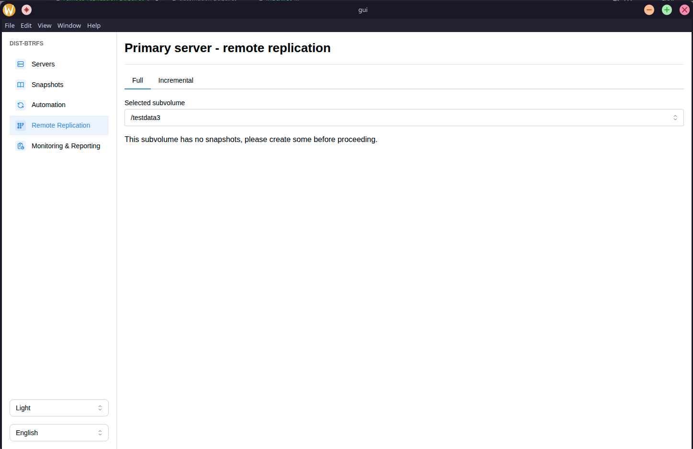

If we the selected subvolume has snapshots, then we will be allowed to proceed.

We need then to select one of the snapshots, and after selecting it, we should get the snapshots details displayed.

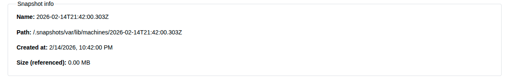

We get information such as its name, its path, when it was created at and its size.

After that, we should select the remote servers to which we want to send the snapshot. After doing it, our form should be filled and the replicate button should get enabled.

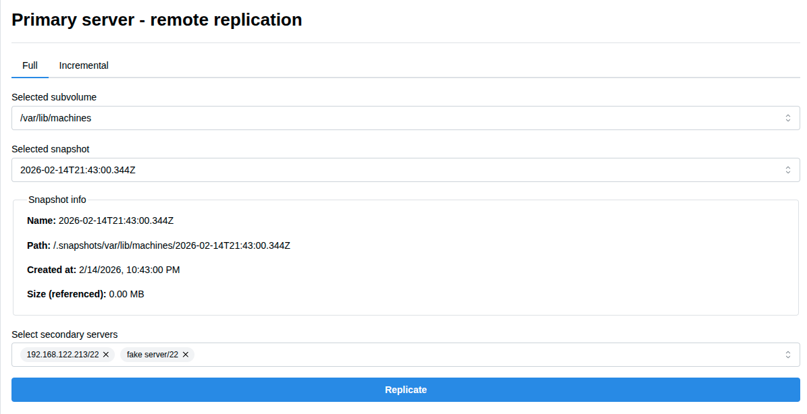

We can see that we selected a real secondary server and then a fake secondary server with an invalid ip.

Lets click on the replicate button and see what happens

Viewing the results of full replication
----------------------------------------------------------------

Depending on the size of the snapshot, and the amount of secondary servers selected this might take some time.

There is no reliable way to show how much time is left, so an indeterminate loading spinner is shown.

After it finishes, we should see this section:

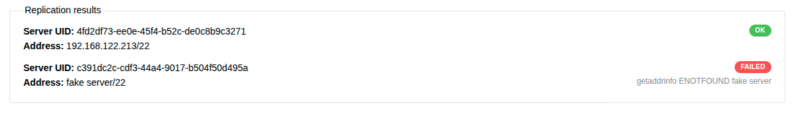

As you can see, we get a report for each remote server selected. We can see that for the real one we got OK as the status, while for the fake one we get FAILED as the status with the reason why it failed.

With this, you have now sent your snapshot to the secondary server.

The look of the incremental tab
----------------------------------------------------------------

Incremental tab consists of a form that is much larger than on the full replication tab. It has many steps and you will see why this is much easier to do with the GUI application than doing it manually via commands.

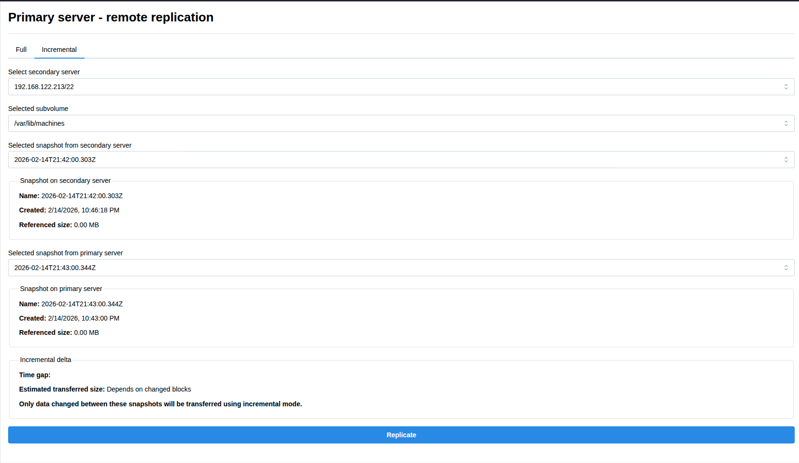

The form consists of secondary server selector, selected subvolume on the secondary server, selected snapshot from the secondary server, details about that snapshot, then selected snapshot from the primary server from the same subvolume and then details of that snapshot on the primary server and then finally section that displays the incremental delta.

This is probably overwhelming at first, but we will go step by step in the next section.

Doing your first incremental replication
----------------------------------------------------------------

First step would be to choose the secondary server from the secondary server selector. 

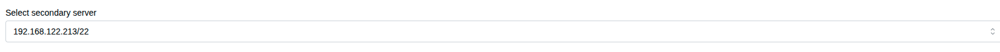

After that, we need to select a subvolume from that secondary server.

The API does a check if that subvolume exists on the primary server.

If it does not, we will get greeted by this screen.

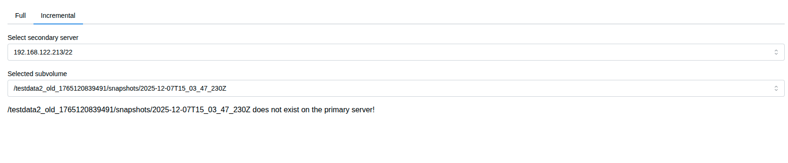

Because of the nature of incremental replication, the subvolume needs to exist on both the secondary server and the primary server.

Lets select a subvolume that checks this condition.

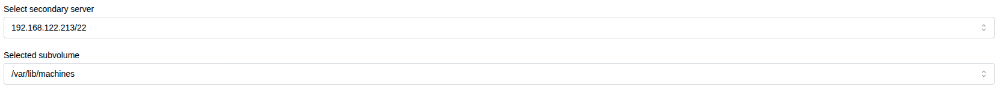

After that, we need to select a snapshot from the selected subvolume.

The API does a check if that snapshot exists on the primary server.

If it does not, we will get greeted by this screen.

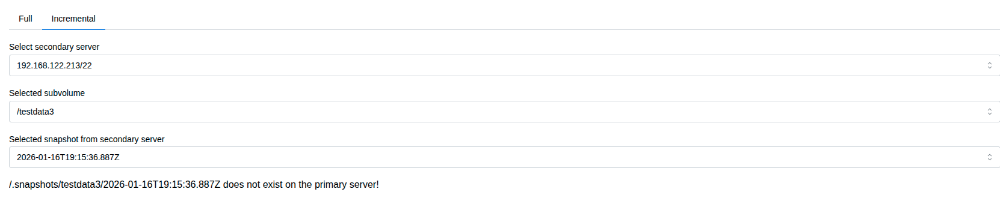

Because of the nature of incremental replication, the snapshot needs to exist on both the secondary server and the primary server.

Lets select a snapshot that fullfils this condition.

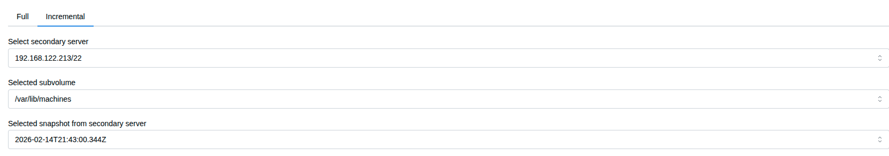

Now the API does a check if there is a snapshot that is newer than the selected one. If there isn't, we get greeted by this screen:

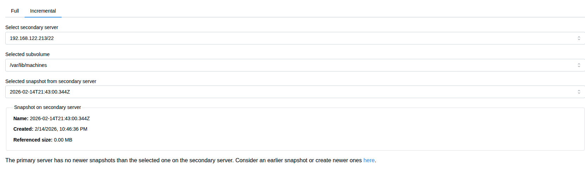

This means that the primary server has no newer snapshots than the selected one on the secondary server. We need to consider an earlier snapshot or create a newer one.

Again, this is because of the nature of incremental replication.

Lets select an earlier snapshot.

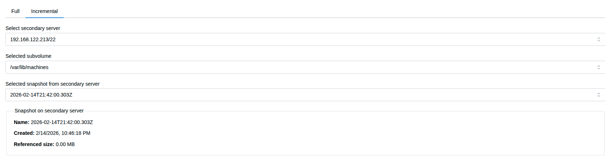

We can see that we can see the section that shows the details of the selected snapshot.

The next step would be to select a newer snapshot on the primary server. Let's do that.

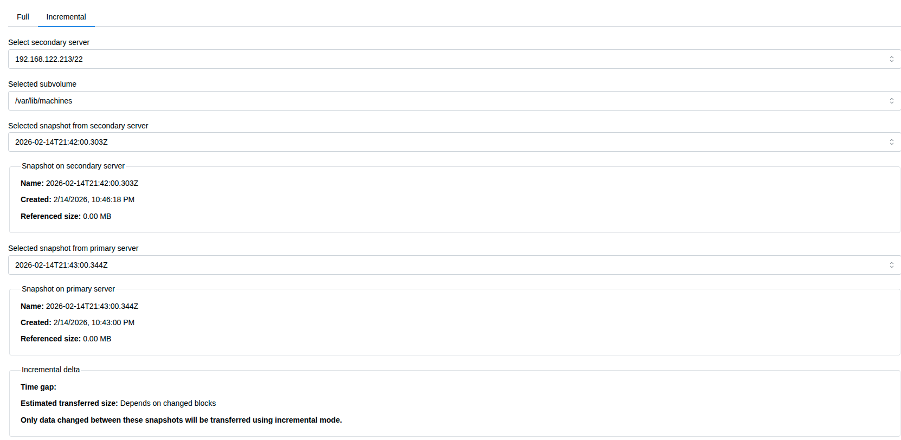

We can now see the details of the newer snapshot from the primary server, and the section that shows the incremental delta.

The incremental delta shows us the time gap between these two snapshots, estimated transfer size and some more information.

The replicate button should now be enabled.

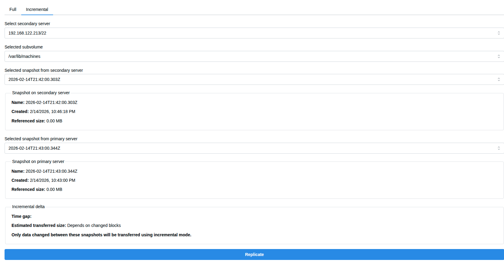

Lets click it.

Viewing the results of incremental replication
----------------------------------------------------------------

Depending on the size of the snapshot, this might take some time but it should be much quicker than full replication.

There is no reliable way to show how much time is left, so an indeterminate loading spinner is shown.

After it finishes, we should see this section:

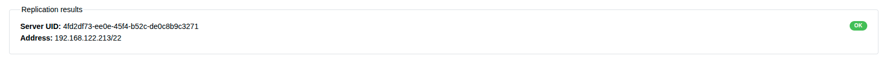

As you can see, we get a report.

With this, you have now sent your snapshot to the secondary server.

Overview
----------------------------------------------------------------

After reading this page you should be able to do replications, either full or incremental pretty easily.

You can see that incremental replication is a much better option, but it has a lot of requirements and depends on full replication.