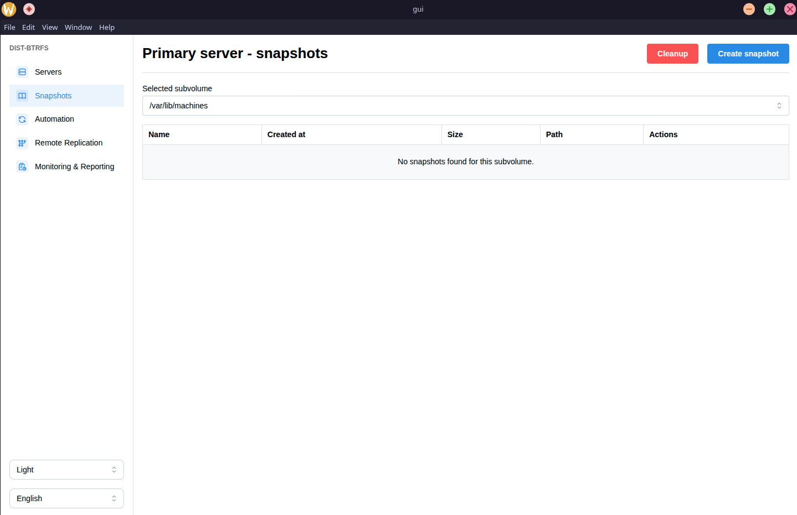
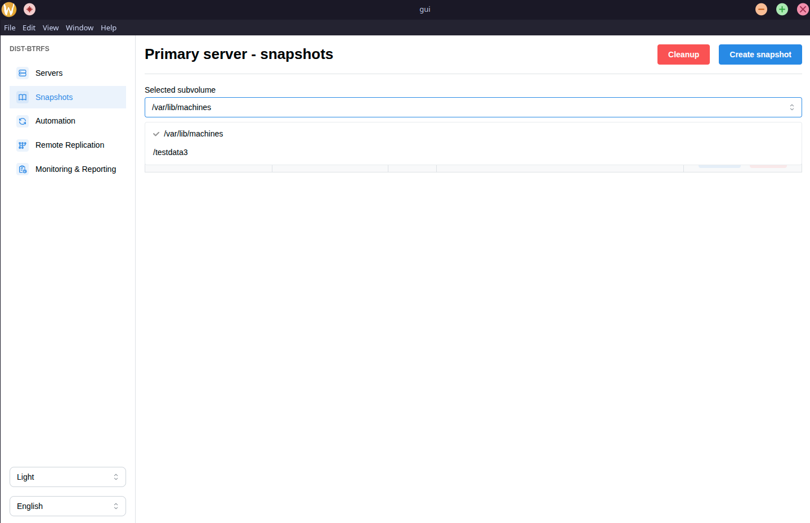
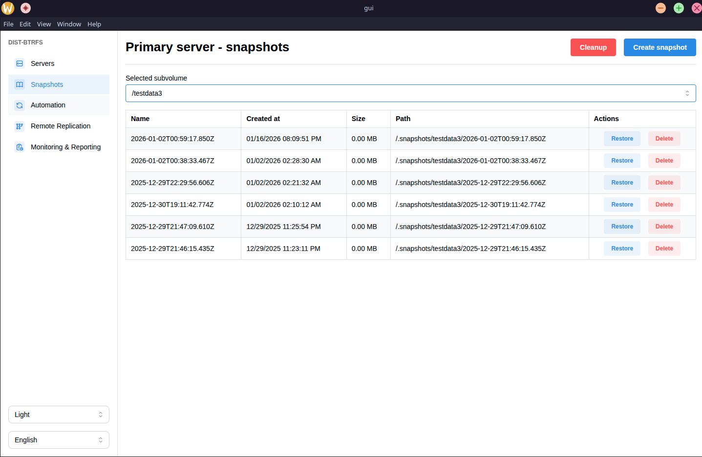
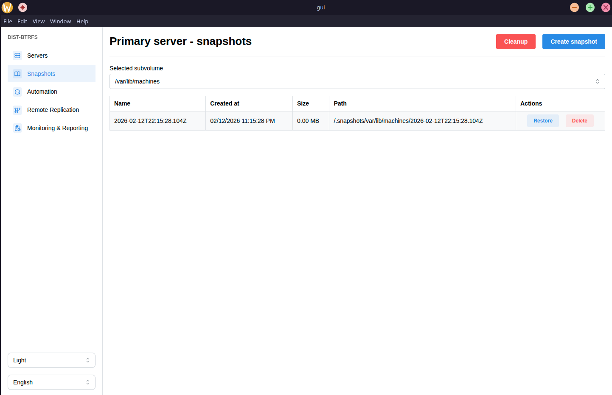
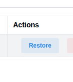
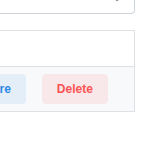
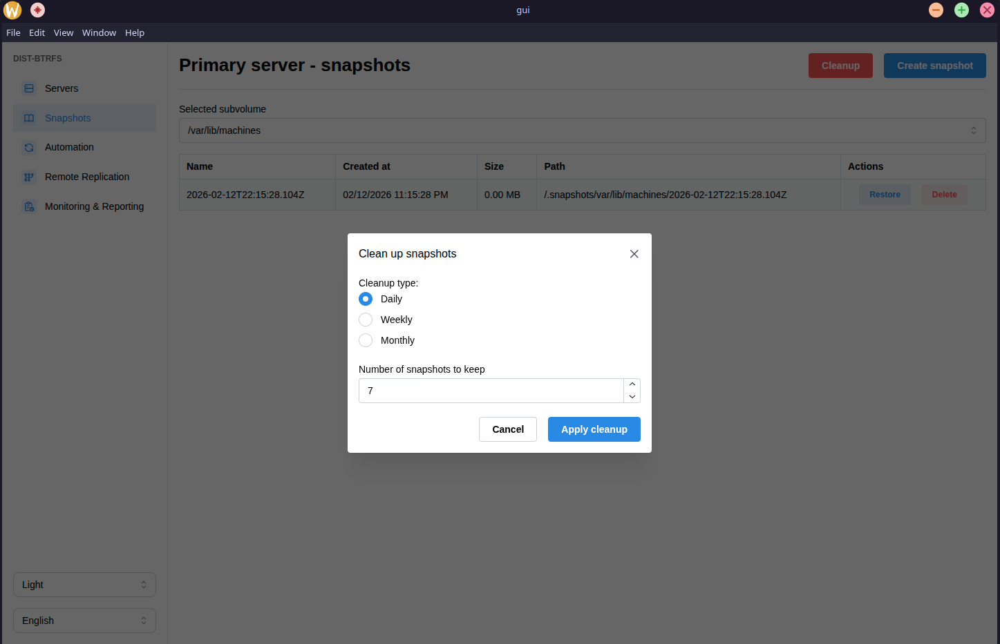

Snapshots page
===============

The snapshots page is the page where you will be able to manage the snapshots of the primary server.

Here, you are able to create snapshots with a click of a button, see all of the snapshots for certain subvolumes and restore to that snapshot or delete that snapshot.

You are also able to run cleanup, and apply one of the retention policies.

The look of the page
--------------------------------

This is how the page would look like when the primary server is added.

As you can see, there is a select where u are able to choose one of the subvolumes, and list all snapshots that are created for that subvolume.

Subvolume selector
--------------------------------

By clicking on the select you will see all of the subvolumes.

If we click on the ``/testdata3`` subvolume, we will see all of its snapshots listed.

Please note that size is displaying as 0.00 MB is because the actual size of the snapshot is extremely small.

We get the name of the snapshot, when it was created, its saize, and at what path they are created. 

All of the snapshots are created under the ``/.snapshots/{subvolume}/{timestamp}`` path.

Creating your first snapshot
--------------------------------

Creating a snapshot is really simple. All you need to is click on the create snapshot button.

After clicking the create snapshot button, after it finishes loading you should see a snapshot in the table for that subvolume.

As you can see above, after we created the snapshot we see it in the table.

Restoring to a certain snapshot
--------------------------------

All you need to do to restore to a snapshot on your primary server is to click on the restore button in the last column.

Deleting a certain snapshot
--------------------------------

All you need to delete a certain snapshot is to click on the delete button in the last column.

Cleanup
--------------------------------

You will have a couple of subvolumes that are full of snapshots. You might want to consider cleaning them up.

To clean them up, all you need to click on the cleanup button in the upper right corner.

After you click on it, a modal should appear.

You can apply cleanup on daily, weekly and monthly level.

* Daily would mean grouping snapshots on daily level, and keeping only n latest snapshots.
* Weekly would mean grouping snapshots on weekly level, and keeping only n latest snapshots.
* Monthly would mean grouping snapshots on monthly level, and keeping only n latest snapshots.

Overview
--------------------------------

You should be able to now use this page to manage snapshots on the primary servers subvolumes.